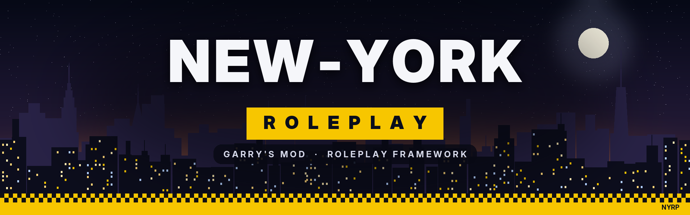

<p align="center"></p>

# New-York Roleplay (NYRP)

Фреймворк-гейммод для Garry's Mod: ролевая игра в Нью-Йорке.

## Установка

1. Распакуйте `dist/newyorkrp_gamemode.zip` в папку `garrysmod/` сервера (получится `garrysmod/gamemodes/newyorkrp`)
   — или скопируйте `gamemodes/newyorkrp` вручную.
2. Контент (шрифты, иконки, звуки, музыка, модели) лежит в `gamemodes/newyorkrp/content` и подключается
   автоматически. Клиенты получают его через FastDL (`core/sv_resources.lua`). Второй вариант —
   залить `dist/newyorkrp_content.zip` в Workshop или распаковать его в `garrysmod/addons/`.
3. Запуск: `+gamemode newyorkrp +map rp_...`

## Что есть

| Система | Где | Кратко |
|---|---|---|
| Ходьба, бег, прыжки | `modules/movement` | шаг 110 / бег 225 / медленно 70, бег спиной медленнее, без распрыжки, замедление при приземлении |
| Иммерсивная камера | `modules/camera` | камера в глазах, видно всё тело, качание от анимаций, «присед» при приземлении, третье лицо с затемнением |
| Прицел и курсор | `camera/cl_crosshair`, `core/cl_cursor` | кольцо-прицел, при наведении оранжевое; свой курсор во всех окнах |
| Инвентарь (Q) | `modules/inventory`, `modules/items` | поясная сумка/рюкзак, анимация открытия, ячейки, перетаскивание, ПКМ-меню, панель предмета, снаряжение, прогресс-бар «Одеваю…/Орудую…» |
| Удостоверение | `inventory/cl_passport` | выдаётся при первом входе персонажа, ПКМ → Посмотреть / Показать человеку |
| Знакомства | `modules/recognition` | над игроком «НЕИЗВЕСТНЫЙ» или имя; познакомиться: `/познакомиться` или показать удостоверение; маска скрывает лицо |
| Персонажи | `modules/characters` | интро, главное меню, выбор и создание персонажа, пробуждение с зевком |
| Подсказки | `modules/interact` | иконки в мире у дверей (на ручке), предметов и энтити, подпись, обводка |
| Чат | `modules/chat` | IC / шёпот / крик / me / OOC / LOOC, «Говорит…» и сообщения над головой |
| Голос | `modules/voice` | по дистанции, без стандартных панелей, свой значок микрофона |
| TAB | `modules/scoreboard` | панель слева: онлайн, ники, часы игры, ПКМ — SteamID и профиль |
| ESC | `modules/pausemenu` | меню паузы, настройки, бинды (третье лицо и его меню) |
| Смерть | `modules/death` | мягкий рэгдолл, камера из глаз, экран смерти с таймером |
| Голод/жажда | `modules/needs` | полоски в инвентаре: тёмно-красная, тёмно-жёлтая, тёмно-голубая |

## Камеры меню (суперадмин)

Точки сохраняются в `data/nyrp/points/<карта>.json` и **не теряются после перезапуска**.

| Команда | Что делает |
|---|---|
| `nyrp_point intro add` / `clear` | точка пролёта камеры в интро (ставится по вашему взгляду; нужно минимум 2) |
| `nyrp_point menu set` | камера главного меню |
| `nyrp_point chars set` | камера выбора персонажей |
| `nyrp_point spot add` / `clear` | место, где стоит персонаж (по вашим ногам и повороту) |
| `nyrp_point create add` / `clear` | точки пролёта камеры к созданию персонажа |
| `nyrp_points` | что уже задано |
| `nyrp_chareditor` | редактор расстановки: клик по модели, сдвиг, поворот, сохранить |

**Если камеры меню, выбора и хотя бы одно место не заданы**, игрока сразу закидывает за персонажа:
последнего, первого из своих или нового случайного (случайные имя, описание, модель, рост, навыки, сумка).

## Прочие команды

| Команда | Кто | Что |
|---|---|---|
| `nyrp_testkit` | суперадмин | выдать набор тестовых предметов |
| `nyrp_giveitem <id> [n]` | суперадмин | выдать предмет |
| `nyrp_spawnitem <id> [n]` | суперадмин | заспавнить предмет перед собой |
| `nyrp_toggle_thirdperson` | все | третье лицо (по умолчанию F3) |
| `nyrp_thirdperson_menu` | все | меню третьего лица (по умолчанию F4) |
| `nyrp_introduce` | все | представиться тому, на кого смотрите |
| Shift+Q / C | админ | стандартное спавн-меню / контекстное меню |

Предметы: `water soda coffee takeout milk medkit painkillers cap sunglasses mask tshirt jacket gloves jeans sneakers pistol revolver smg shotgun crowbar baton idcard`.
Энтити для примера: `nyrp_vending` (автомат с газировкой, в спавн-меню «New-York Roleplay»).

## Контент

| Что | Откуда | Лицензия |
|---|---|---|
| Шрифты Manrope, Oswald | Google Fonts (npm `@expo-google-fonts/*`) | OFL |
| Иконки | Tabler Icons | MIT |
| Звуки интерфейса | uisfx (паки soft и cinematic) | MIT |
| Молния, шорох ткани, зевок, вдох, сердцебиение, смерть | синтез, `tools/content/synth_audio.py` | свои |
| Музыка «Night City» (lo-fi, дождь, сирена вдали; петля 98 с) | синтез, `tools/content/synth_audio.py` | своя |
| Модели сумок, одежды, удостоверения | Blender, `tools/models/*.py` | свои |

Пересборка: `python3 tools/content/build_content.py <node_modules>`, `python3 tools/content/synth_audio.py`,
`python3 tools/models/build_bags.py`, `python3 tools/models/build_clothes.py`, `python3 tools/content/make_archive.py`.

### Модели (.mdl)

`tools/models/mdlc.py` компилирует модели прямо в формат Source MDL v48 (`.mdl .vvd .dx90/.dx80/.sw.vtx .phy`)
без studiomdl. Раскладка сверена с моделью, собранной studiomdl, проверка — `tools/models/mdl_check.py`.
Сумки разбиты на части (корпус, крышка, бегунок), анимацию открытия в игре проигрывает Lua.

Если нужны «полные» модели от studiomdl (анимации внутри .mdl, точная коллизия), запустите на Windows
`tools\compile_models.bat`: он найдёт `studiomdl.exe` в папке Garry's Mod, скомпилирует все `.qc`
из `tools/models/src` и скопирует результат в `content/models/nyrp`.

## Структура

```
gamemodes/newyorkrp/
  gamemode/
    core/        конфиг, сеть, БД, шрифты, UI-элементы, курсор, уведомления, HUD, музыка, настройки
    modules/     системы (каждая папка подключается автоматически: sh_/sv_/cl_)
  entities/      nyrp_item, nyrp_vending, nyrp_hands
  content/       materials, models, sound, resource/fonts
branding/        лого, баннеры, вотермарк, превью моделей
tools/           генераторы контента и моделей
dist/            архивы контента и исходников моделей
```
